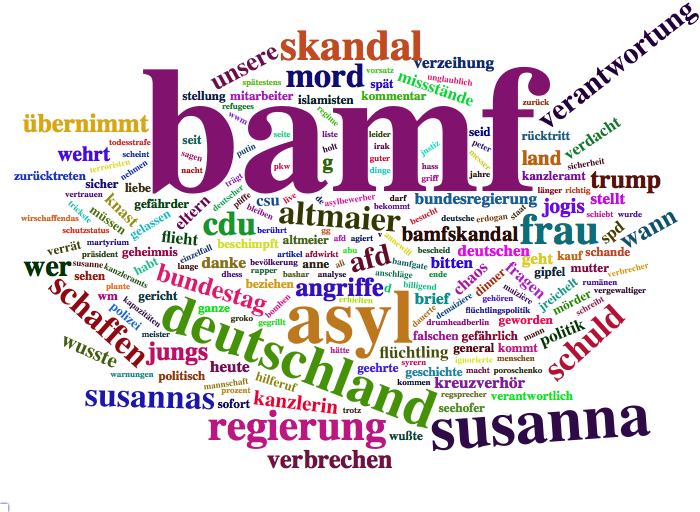
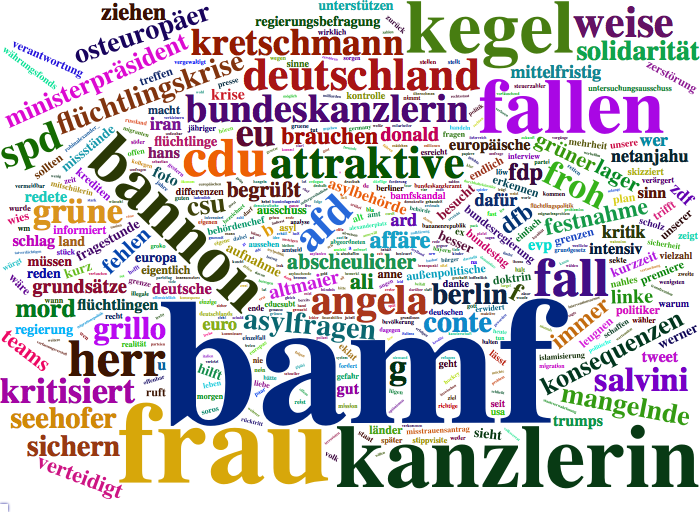
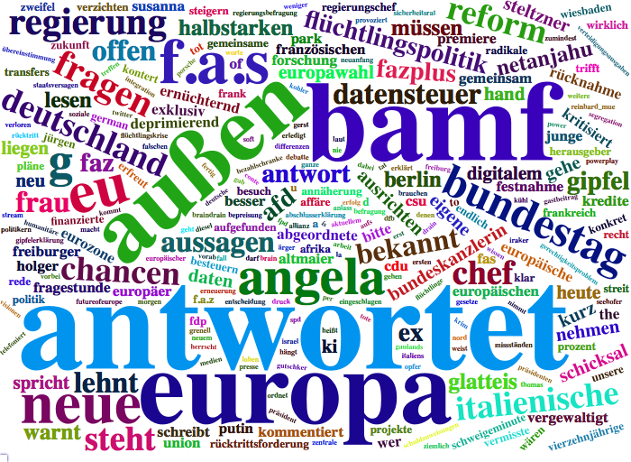
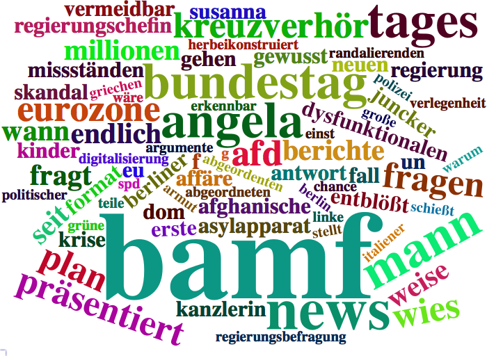
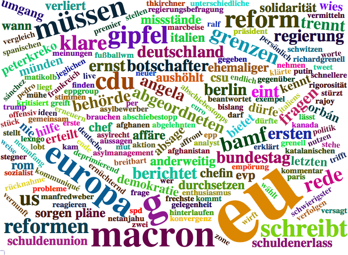
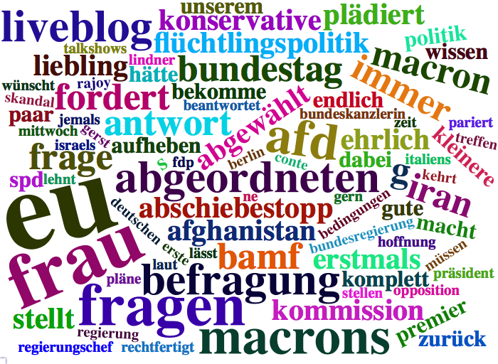

```{r message=FALSE, warning=FALSE, include=FALSE}
rm(list = ls())

## --- Load Packages --- ##
library(rtweet)
library(dplyr)
library(ggplot2)
library(tidyr)
library(tm)
library(wordcloud2)
library(stringr)
library(tidytext)
library(stringi)
library(htmlwidgets)

## --- Set Stylings --- ###
knitr::opts_chunk$set(message=FALSE, warning=FALSE)

theme_set(
  theme_bw(base_size = 14) +
    theme(
      plot.title = element_text(face = "bold", size = 14, 
                                margin = margin(0, 0, 4, 0, "pt")),
      plot.subtitle = element_text(size = 12),
      plot.caption = element_text(size = 6, hjust = 0),
      axis.title = element_text(size = 10),
      panel.border = element_blank()
    )
)

## --- Global Variables --- ##
# Define Color
Mycol <- RColorBrewer::brewer.pal(8, "Dark2")

# Define http pattern
http <- paste(c("http.*","https.*"), sep = "|")

# Define Stopwords
stopwords <- data_frame(
  word =  stopwords("german")
) %>% rbind(
  data_frame(word = c("t.co","via","mal","dass","mehr", "amp",
                      "beim", "ab","sollen","ganz","sagt",
                      "schon","rt","gibt", "ja", "natürlich"))
)
```

```{r eval=FALSE, include=FALSE}
rt <- search_tweets("filter:news AND lang:de", 
                    include_rts = F,
                    retryonratelimit = T,
                    n=200000)

save(rt, file = paste0("../data/", 
                       Sys.Date(),".Rda"))
```

Welche Nachrichten-Inhalte werden aktuell bei Twitter diskutiert? Um das herauszufinden, haben wir die aktuellsten deutschsprachigen Tweets gesammelt, die einen Link zu einer Nachrichtenseite beinhalten. Die Tweets wurden mit Hilfe des R Packetes [rtweet](http://rtweet.info) über die REST API ausgelesen. Der gesamte Code ist [hier](https://github.com/franziloew/news_tweets/tree/master/docs) einzusehen. 

```{r}
load("../../../data/2018-06-11.Rda")
```

```{r fig.width=6}
rt$hashtags %>%
  unlist() %>%
  na.omit() %>%
  table() %>%
  sort(decreasing = TRUE) %>%
  tibble::as_tibble() -> hash_table

colnames(hash_table) <- c("hashtag", "count")

hash_table %>%
  top_n(10, count) %>%
  ggplot( aes(reorder(hashtag,count), count)) +
  geom_col(fill = Mycol[1], alpha = 0.6) +
  coord_flip() +
  labs(
    x = NULL,
    y = NULL,
    title = "Top 10 Hashtags"
  ) 
```

# Wordclouds zum Top Hashtag "Merkel"

```{r eval=FALSE, fig.height=10, fig.width=6, include=FALSE}
# Get top hashtag
rt$hashtags %>%
  unlist() %>%
  na.omit() %>%
  table() %>%
  sort(decreasing = TRUE) %>%
  as.data.frame() %>% top_n(1) -> hash

# Define News
news <- c("welt", "FOCUS_TopNews", "sternde", "faznet", 
          "focusonline", "SZ", "SZ_TopNews",
          "WELTnews", "FAZ_NET", "SPIEGEL_alles", "zeitonline", "BILD")
news_reg <- paste("welt", "FOCUS_TopNews", "sternde", "faznet", 
          "focusonline", "SZ", "SZ_TopNews",
          "WELTnews", "FAZ_NET", "SPIEGEL_alles", "zeitonline", "BILD", sep = "|")

rt_news <- rt %>%
  mutate(stripped_text = gsub(http,"", text)) %>%
   # Remove numers
  mutate(stripped_text =gsub('[[:digit:]]+', '', stripped_text)) %>%

  # create variable indicating wich news profile is mentioned
  mutate(mentions = stri_join_list(stri_extract_all_words(mentions_screen_name),
                                   sep=", ")) %>%
  
  # filter tweets, that mention these profiles
  filter(screen_name %in% news | str_detect(mentions, news_reg)) %>%

  # create new variable to assign news website to the tweet
  mutate(newsName = ifelse(screen_name %in% news, screen_name, mentions)) %>%
  mutate(newsName = str_match(newsName, news_reg))

rt_news <- rt_news %>%
  mutate(newsName = ifelse(grepl("sz",newsName, ignore.case = T), "SZ", newsName),
         newsName = ifelse(grepl("welt",newsName, ignore.case = T), "Welt", newsName),
         newsName = ifelse(grepl("focus",newsName, ignore.case = T), "FOCUS", newsName),
         newsName = ifelse(grepl("faz",newsName, ignore.case = T), "FAZ", newsName)
         )

news <- unique(rt_news$newsName)

rt_news_tidy <- rt_news %>%
  filter(grepl(hash[,1], stripped_text)) %>%
  # Remove punctuation, convert to lowercase, add id for each tweet!
  dplyr::select(newsName, stripped_text) %>%
  unnest_tokens(word, stripped_text) %>%
  
  # Third, remove stop words from your list of words 
  anti_join(stopwords) %>%
  
  group_by(newsName, word) %>%
  count(word) %>%
  ungroup()

# Generate a wordcloud for each news
for (i in news) {
  
  rt_news_tidy %>%
    filter(n>1) %>%
    filter(newsName == i) %>%
    filter(!grepl(news_reg, 
                  word, ignore.case = T)) %>%
    filter(!grepl(hash[,1], 
                  word, ignore.case = T)) %>%
    select(word, n) -> temp
  
  w_temp <- wordcloud2(temp, size = 1, word = hash[,1])
  
  saveWidget(w_temp,paste0(i,".html"),selfcontained = F)
  webshot::webshot(paste0(i,".html"),paste0(i,".png"),
                   vwidth = 700, vheight = 500, delay =10)
}
```

## BILD


## Die Welt


## FAZ


## FOCUS


## Spiegel Online


## Stern.de


## SZ


## Zeit Online

