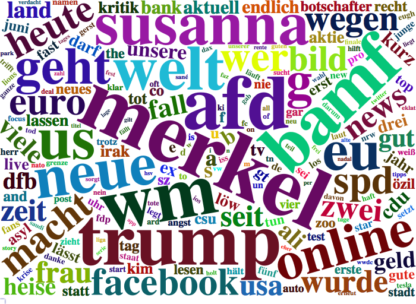

```{r message=FALSE, warning=FALSE}
rm(list = ls())

## --- Load Packages --- ##
library(rtweet)
library(dplyr)
library(ggplot2)
library(rvest)
library(tidyr)
library(wordcloud2)
library(igraph)
library(ggraph)
library(stringr)
library(tm)
library(tidytext)
library(stringi)

## ---- My Functions --- ##
source("functions.R")

## --- Set Stylings --- ###
knitr::opts_chunk$set(message=FALSE, warning=FALSE)

theme_set(
  theme_bw(base_size = 14) +
    theme(
      plot.title = element_text(face = "bold", size = 14, 
                                margin = margin(0, 0, 4, 0, "pt")),
      plot.subtitle = element_text(size = 12),
      plot.caption = element_text(size = 6, hjust = 0),
      axis.title = element_text(size = 10),
      panel.border = element_blank()
    )
)

## --- Global Variables --- ##
# Define Color
Mycol <- RColorBrewer::brewer.pal(8, "Dark2")

# Define http pattern
http <- paste(c("http.*","https.*"), sep = "|")

# Define Stopwords
stopwords <- data_frame(
  word =  stopwords("german")
) %>% rbind(
  data_frame(word = c("t.co","via","mal","dass","mehr", "amp",
                      "beim", "ab","sollen","ganz","sagt",
                      "schon","rt","gibt", "ja", "natürlich"))
)
```

```{r eval=FALSE, include=FALSE}
rt <- search_tweets("filter:news AND lang:de", 
                    include_rts = F,
                    retryonratelimit = T,
                    n=200000)

save(rt, file = paste0("../data/", 
                       Sys.Date(),".Rda"))
```

Welche Nachrichten-Inhalte werden aktuell bei Twitter diskutiert? Um das herauszufinden, haben wir die aktuellsten deutschsprachigen Tweets gesammelt, die einen Link zu einer Nachrichtenseite beinhalten. Die Tweets wurden mit Hilfe des R Packetes [rtweet](http://rtweet.info) über die REST API ausgelesen. Der gesamte Code ist [hier](https://github.com/franziloew/news_tweets/tree/master/docs) einzusehen. 

Folgende Variablen sind in unserem Datensatz vorhanden. 

```{r}
load("../data/2018-06-11.Rda")

colnames(rt)
```

```{r fig.width=8}
rt %>%
  ts_plot("30 minutes",
        color = Mycol[3]) +
  theme(plot.title = element_text(face = "bold")) +
  labs(
    x = NULL, y = NULL,
    title = "Nachrichten-Tweets",
    subtitle = paste("Zeitraum:",min(rt$created_at),"bis",max(rt$created_at))
  ) 
```


```{r fig.width=6}
rt_clean <- rt %>%
  # First, remove http elements manually
  mutate(stripped_text = gsub(http,"", text)) 
  
rt_tidy_words <- rt_clean %>%
  # Second, remove punctuation, convert to lowercase, add id for each tweet!
  dplyr::select(stripped_text) %>%
  unnest_tokens(word, stripped_text) %>%
  
  # Third, remove stop words from your list of words 
  anti_join(stopwords) %>%
  
  # Count Word occurences
  count(word, sort = TRUE) 

wordcloud2(rt_tidy_words, size = 1, color = "random-light", backgroundColor = "grey")

library(htmlwidgets)
install.packages("webshot")
webshot::install_phantomjs()
library(wordcloud2)
hw = wordcloud2(demoFreq,size = 3)
saveWidget(hw,"1.html",selfcontained = F)
webshot::webshot("1.html","1.png",vwidth = 700, vheight = 500, delay =10)
```



```{r fig.height=10, fig.width=6}
news <- c("welt", "FOCUS_TopNews", "sternde", "faznet", 
          "focusonline", "SZ", "SZ_TopNews",
          "WELTnews", "FAZ_NET", "SPIEGEL_alles", "zeitonline", "BILD")
news_reg <- paste("welt", "FOCUS_TopNews", "sternde", "faznet", 
          "focusonline", "SZ", "SZ_TopNews",
          "WELTnews", "FAZ_NET", "SPIEGEL_alles", "zeitonline", "BILD", sep = "|")

rt_news <- rt %>%
  mutate(stripped_text = gsub(http,"", text)) %>%

  # create variable indicating wich news profile is mentioned
  mutate(mentions = stri_join_list(stri_extract_all_words(mentions_screen_name),
                                   sep=", ")) %>%
  
  # filter tweets, that mention these profiles
  filter(screen_name %in% news | str_detect(mentions, news_reg)) %>%

  # create new variable to assign news website to the tweet
  mutate(newsName = ifelse(screen_name %in% news, screen_name, mentions)) %>%
  mutate(newsName = str_match(newsName, news_reg))
```

```{r eval=FALSE, include=FALSE}
rt_news_tidy <- rt_news %>%
  # Remove punctuation, convert to lowercase, add id for each tweet!
  dplyr::select(news_name, stripped_text) %>%
  unnest_tokens(word, stripped_text) %>%
  
  # Third, remove stop words from your list of words 
  anti_join(stopwords) %>%
  
  group_by(news_name, word) %>%
  count(word) %>%
  ungroup()

# Generate a wordcloud for each news
for (i in news) {
  
  rt_news_tidy %>%
    filter(news_name == i) %>%
    filter(!grepl(i, word, ignore.case = T)) %>%
    select(word, n) -> temp
  
  print(wordcloud2(temp))
  # htmlwidgets::saveWidget(wordcloud2(temp),
  #                         selfcontained = F,
  #                         file = paste0("wordcloud",i,".html"), 
  #                         title = paste(i))
  
  
    
}
```


