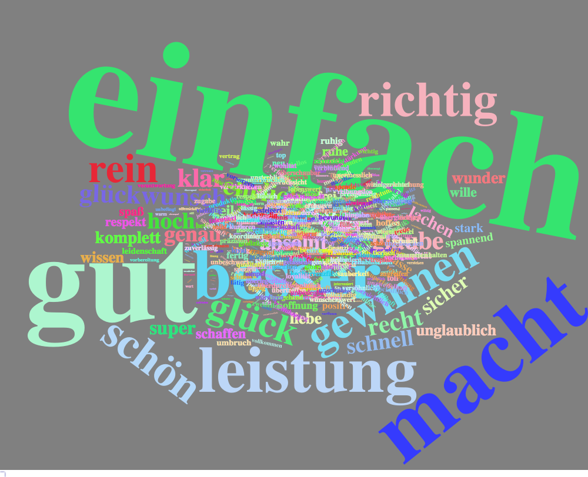
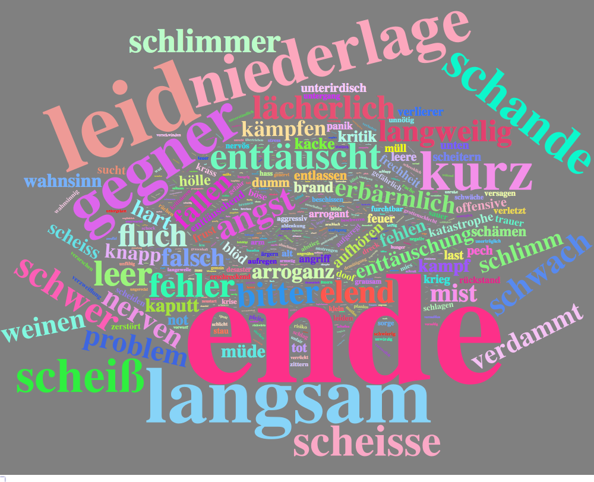
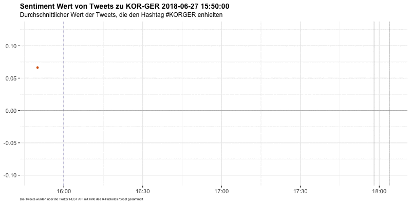

```{r message=FALSE, warning=FALSE}
rm(list = ls())
setwd("~/Projects/news_tweets")
## --- Load Packages --- ##
library(rtweet)
library(dplyr)
library(ggplot2)
library(rvest)
library(tidyr)
library(wordcloud2)
library(igraph)
library(ggraph)
library(stringr)
library(tm)
library(tidytext)
library(stringi)
library(lubridate)
library(gganimate)
library(htmlwidgets)

## --- Set Stylings --- ###
knitr::opts_chunk$set(message=FALSE, warning=FALSE)

theme_set(
  theme_bw(base_size = 14) +
    theme(
      plot.title = element_text(face = "bold", size = 14, 
                                margin = margin(0, 0, 4, 0, "pt")),
      plot.subtitle = element_text(size = 12),
      plot.caption = element_text(size = 6, hjust = 0),
      axis.title = element_text(size = 10),
      panel.border = element_blank()
    )
)

## --- Global Variables --- ##
# Define Color
Mycol <- RColorBrewer::brewer.pal(8, "Dark2")

# Define http pattern
http <- paste("http.*","https.*", sep = "|")

# Define Stopwords
stopwords <- data_frame(
  word =  stopwords("german")
) %>% rbind(
  data_frame(word = c("t.co","via","mal","dass","mehr", "amp","https",
                      "beim", "ab","sollen","ganz","sagt",
                      "schon","rt","gibt", "ja", "natürlich"))
)
```

```{r eval=FALSE, include=FALSE}
rt <- search_tweets("#KORGER AND lang:de", 
                    include_rts = F,
                    retryonratelimit = T,
                    n=200000)

save(rt, file = "../../data/korger.Rda")
```


Deutschsprachige Tweets die den Hashtag "#KORGER" beinhalten. Die Tweets wurden mit Hilfe des R Packetes [rtweet](http://rtweet.info) über die REST API ausgelesen. Der gesamte Code ist [hier](https://github.com/franziloew/news_tweets/tree/master/docs) einzusehen. 

```{r}
load("../../data/korger.Rda")
attr(rt$created_at, "tzone") <- "Europe/Berlin"

start <- as.POSIXct("2018-06-27 15:00", tz = "Europe/Berlin")
end <- start + minutes(280)

gamestart <- as.POSIXct("2018-06-27 16:00", tz = "Europe/Berlin")
gameend <- gamestart + minutes(45) + minutes(3) + minutes(15) + minutes(45) + minutes(7) 

rt_small <- rt %>% 
#  mutate(created_at = as.POSIXct(created_at + hours(2))) %>%
  filter(created_at >= start) %>%
  filter(created_at <= end) 
```

## Zeitraum

```{r fig.height=6, fig.width=8}
rt_small %>%
  ts_plot("1 minute",
        color = Mycol[3]) +
  geom_vline(xintercept = gamestart, color=Mycol[1], linetype = 2) +
  geom_vline(xintercept = gameend, color=Mycol[1], linetype = 2) +
  theme(plot.title = element_text(face = "bold"),
        axis.text.x = element_blank()) +
  labs(
    x = NULL, y = NULL,
    title = "Tweets zum Spiel Südkorea - Deutschland",
    subtitle = paste("Zeitraum:",min(rt_small$created_at),"bis",max(rt_small$created_at))
  ) 
```

## Wordcloud

```{r}
rt_clean <- rt_small %>%
  # First, remove http elements manually
  mutate(stripped_text = gsub(http,"", text)) %>%
  mutate(stripped_text = gsub("korger","", text, ignore.case = T)) 
  
rt_tidy_words <- rt_clean %>%
  # Second, remove punctuation, convert to lowercase, add id for each tweet!
  dplyr::select(stripped_text) %>%
  unnest_tokens(word, stripped_text) %>%
  
  # Third, remove stop words from your list of words 
  anti_join(stopwords) %>%
  
  # Count Word occurences in a tweet
  count(word, sort = TRUE) 

rt_tidy_words %>%
  wordcloud2(size = 2, 
           color = "random-light", backgroundColor = "grey")
```

#### Wie sind die Wörter miteinander verlinkt?

```{r include=FALSE}
# Word Network
word_network <- function(x) {
  
  # create dataframe
  word_counts <- x %>%
    dplyr::select(stripped_text) %>%
    unnest_tokens(paired_words, 
                  stripped_text, token = "ngrams", n = 2) %>%
    separate(paired_words, c("word1", "word2"), sep = " ") %>%
    filter(!word1 %in% stopwords$word) %>%
    filter(!word2 %in% stopwords$word) %>%
    count(word1, word2, sort = TRUE)
  
  lower <- quantile(word_counts$n, probs = 0.998)
  
  # plot word network
  word_counts %>%
    filter(n > lower) %>%
    graph_from_data_frame() %>%
    ggraph(layout = "fr") +
    geom_edge_link(aes(edge_alpha = n, edge_width = n)) +
    geom_node_point(color = Mycol[2], size = 3) +
    geom_node_text(aes(label = name), 
                   repel = TRUE,
                   color = Mycol[1],
                   vjust = 1.8, size = 5) +
    labs(title = NULL,
         x = "", y = "") +
    theme(axis.text = element_blank(),
          axis.ticks = element_blank(),
          plot.title = element_text(size = 18))
  
}
```

```{r fig.height=12, fig.width=12}
word_network(rt_clean)
```

# Sentiment Analyse

Lexikon Ansatz unter Verwendung des [SentimentWortschatz](http://wortschatz.uni-leipzig.de/de/download)

```{r}
sent <- c(
  # positive Wörter
  readLines("../../dict/SentiWS_v1.8c_Negative.txt",
            encoding = "UTF-8"),
  # negative Wörter
  readLines("../../dict/SentiWS_v1.8c_Positive.txt",
            encoding = "UTF-8")
) %>% lapply(function(x) {
  # Extrahieren der einzelnen Spalten
  res <- strsplit(x, "\t", fixed = TRUE)[[1]]
  return(data.frame(words = res[1], value = res[2],
                    stringsAsFactors = FALSE))
}) %>%
  bind_rows %>% 
  mutate(word = gsub("\\|.*", "", words) %>% tolower,
         value = as.numeric(value)) %>%
  # manche Wörter kommen doppelt vor, hier nehmen wir den mittleren Wert
  group_by(word) %>% summarise(value = mean(value)) %>% ungroup
```

```{r}
sentDF <- rt_clean %>%
  # Second, remove punctuation, convert to lowercase, add id for each tweet!
  unnest_tokens(word, stripped_text) %>%
  left_join(., sent, by="word") %>% 
  mutate(value = as.numeric(value)) %>% 
  #filter(!is.na(value)) %>%
  mutate(negative = ifelse(value < 0, value, NA),
         positive = ifelse(value > 0, value, NA),
         negative_d = ifelse(value < 0, 1, 0),
         positive_d = ifelse(value > 0, 1, 0)) 
```

### Wordclouds

#### Positive Wörter
```{r eval=FALSE, include=FALSE}
w <- sentDF %>%
  filter(positive_d == 1) %>%
  count(word) %>%
  wordcloud2(color = "random-light", size = 2, backgroundColor = "grey")

saveWidget(w,"pos_korger.html",selfcontained = F)
webshot::webshot("pos_korger.html","pos_korger.png",vwidth = 1000, vheight = 800, delay =10)
```

 

#### Negative wörter
```{r eval=FALSE, include=FALSE}
w <- sentDF %>%
  filter(negative_d == 1) %>%
  count(word) %>%
  wordcloud2(color = "random-light", size =2, backgroundColor = "grey")


saveWidget(w,"neg_korger.html",selfcontained = F)
webshot::webshot("neg_korger.html","neg_korger.png",vwidth = 1000, vheight = 800, delay =10)
```




```{r}
sentDF.grouped <- sentDF %>%
  group_by(status_id) %>%
  summarise(mean_value = mean(value, na.rm = T),
            sum_value = sum(value, na.rm = T),
            positive = sum(positive, na.rm = T),
            negative = sum(negative, na.rm = T)) %>%
  left_join(., rt_small %>% dplyr::select(status_id, screen_name, text, created_at),
            by = "status_id") %>%
  filter(!is.na(mean_value))

sentDF.grouped %>%
  filter(created_at > gamestart-minutes(10)) %>%
  filter(created_at < gameend+minutes(10)) %>%
  mutate(minute = as.POSIXct(substr(created_at,1,16))) %>%
  group_by(minute) %>%
  summarise(mean_value = mean(mean_value)) -> animate
```

### Sentiment im Zeitveraluf

```{r eval=FALSE, include=FALSE}
grouped <- ggplot(animate) +
  geom_vline(xintercept = gamestart, color = Mycol[3], linetype = 2) + 
  # Tor Korea
  geom_vline(xintercept = gamestart + minutes(118), color = "grey50", size = 0.2) +
  # Tor DEU
  geom_vline(xintercept = gamestart + minutes(118) + minutes(6), color = "grey50", size = 0.2) +
  geom_hline(yintercept = 0, color = "grey50", size = 0.2) +
  geom_point(aes(minute, mean_value,
                 frame = minute,
                 cumulative = TRUE),
             color = Mycol[2],
             show.legend = F) +
  labs(x=NULL, y=NULL, title = "Sentiment Wert von Tweets zu KOR-GER",
       subtitle = "Durchschnittlicher Wert der Tweets, die den Hashtag #KORGER enhielten",
       caption = "Die Tweets wurden über die Twitter REST API mit Hilfe des R-Packetes rtweet gesammelt")

gganimate(grouped, interval=.3, "korger.gif", ani.width=800, ani.height=400)
```



